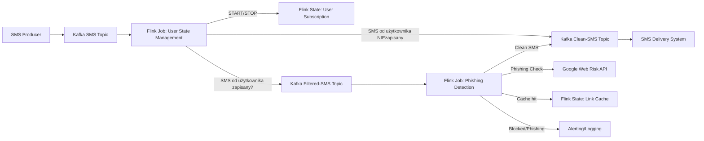

# Opis zadania

## Zadanie

Hipotetyczny operator telekomunikacyjny dogadał się ze związkiem banków, że będzie zapobiegał otrzymywaniu phishingowych wiadomości tekstowych przez abonentów sieci, którzy wyrazili na to chęć. Celem jest stworzenie prostego rozwiązania, które będzie służyło temu celowi.

## Założenia

- Operator przechowuje SMS-y w postaci JSON. Przykładowy rekord:
  ```json
  {
    "sender": "234100200300",
    "recipient": "48700800999",
    "message": "Dzień dobry. W związku z audytem nadzór finansowy w naszym banku proszą o potwierdzanie danych pod adresem: https://www.m-bonk.pl.ng/personal-data"
  }
  ```
- Rozwiązanie powinno obsługiwać wszystkie SMS-y, wykrywać phishing i odrzucać takie przypadki.
- Do oceny, czy URL wskazuje na stronę phishingową, należy użyć zewnętrznego serwisu dostępnego po HTTP: [Google Web Risk API](https://cloud.google.com/web-risk/docs/reference/rest/v1eap1/TopLevel/evaluateUri). Serwis jest płatny za każde wywołanie. Pełna obsługa interfejsu nie jest wymagana – token autoryzacyjny może być parametrem konfiguracyjnym.
- Użytkownicy wyrażają chęć skorzystania lub rezygnacji z usługi przez wysłanie SMS o treści `START` lub `STOP` na określony numer.

## Wymagania techniczne

- Rozwiązanie należy stworzyć w dowolnym języku JVM (Java/Kotlin/Scala).
- Kod źródłowy powinien być dostępny w publicznym repozytorium GitHub.
- Rozwiązanie powinno budować obraz(y) wykonywalny(e) Docker, przechowywany(e) w serwisie Docker Hub, wraz z krótkim opisem uruchomienia.
- Cały kod należy umieścić w nowym pull request (dla ułatwienia review).

## Dodatkowe informacje

- Jeśli przyjęto dodatkowe założenia, należy je opisać w pliku README.
- Jednym z ocenianych elementów jest przyjęta architektura rozwiązania. Decyzje architektoniczne należy opisać w README.
- Operatorowi zależy na szybkim czasie wdrożenia i niskim koszcie obsługi.
## Proponowana architektura: Przetwarzanie strumieniowe z Apache Kafka i Apache Flink

**Założenia**
* Detekcja phishingu jest wykonywana wyłącznie dla SMS-ów, których odbiorcy są zapisani do usługi antyphishingowej (opcja opt-in). Dla pozostałych użytkowników wiadomości są przekazywane bez dodatkowej analizy.
* System korzysta z cache przy sprawdzaniu linków z racji tego że API kosztuje oraz ze zwględu na wydajność. Nie chcemy sprawdzać w zewnętrzym API więcej niż raz tych samych linków
* Korzystamy z "Flink State" ponieważ zależy nam na szybkości oraz nie chcemy narazie komplikować
  systemu i zwiększaść ilości zależności, przy wykorzystaniu zewenętrzej bazy

**Opis komponentów:**
- **Kafka SMS Topic** – punkt wejścia dla wszystkich wiadomości SMS (JSON).
- **Flink SMS Processing Job** – przetwarza strumień SMS, rozpoznaje komendy START/STOP, aktualizuje status użytkownika. Dla każdego SMS-a sprawdza, czy odbiorca jest zapisany do usługi:
    - Jeśli TAK: przekazuje wiadomość do dalszej analizy phishingu.
    - Jeśli NIE: przekazuje wiadomość bezpośrednio do dostarczenia (bez analizy phishingu).
- **User Subscription State Store** – przechowuje status opt-in/opt-out użytkowników (np. Flink state, Redis, baza SQL).
- **Flink Phishing Detection Job** – analizuje tylko SMS-y użytkowników zapisanych do usługi, sprawdza linki przez Google Web Risk API, przekazuje czyste wiadomości dalej.
- **Google Web Risk API** – sprawdza podejrzane linki, z cache’owaniem wyników dla ograniczenia kosztów.
- **Kafka Clean-SMS Topic** – temat dla zweryfikowanych, bezpiecznych wiadomości oraz tych, które nie wymagają analizy (użytkownicy nie zapisani).
- **SMS Delivery System** – system końcowy dostarczający SMS do odbiorcy.
- **Alerting/Logging** – obsługa przypadków phishingu (logi, alerty).

### Diagram architektur




**Opis:**
- Pierwszy job Flinka obsługuje START/STOP, aktualizuje stan użytkownika i dla każdego SMS-a sprawdza, czy odbiorca jest zapisany do usługi:
    - Jeśli TAK: przekazuje SMS do kolejnego joba (detekcja phishingu).
    - Jeśli NIE: przekazuje SMS bezpośrednio do dostarczenia (bez analizy phishingu).
- Drugi job Flinka zajmuje się detekcją phishingu wyłącznie dla SMS-ów użytkowników zapisanych do usługi, integracją z Google Web Risk API i przekazywaniem bezpiecznych wiadomości do końcowego systemu.
- Stan użytkowników przechowywany jest w Flink state joba "Phishing detection"
